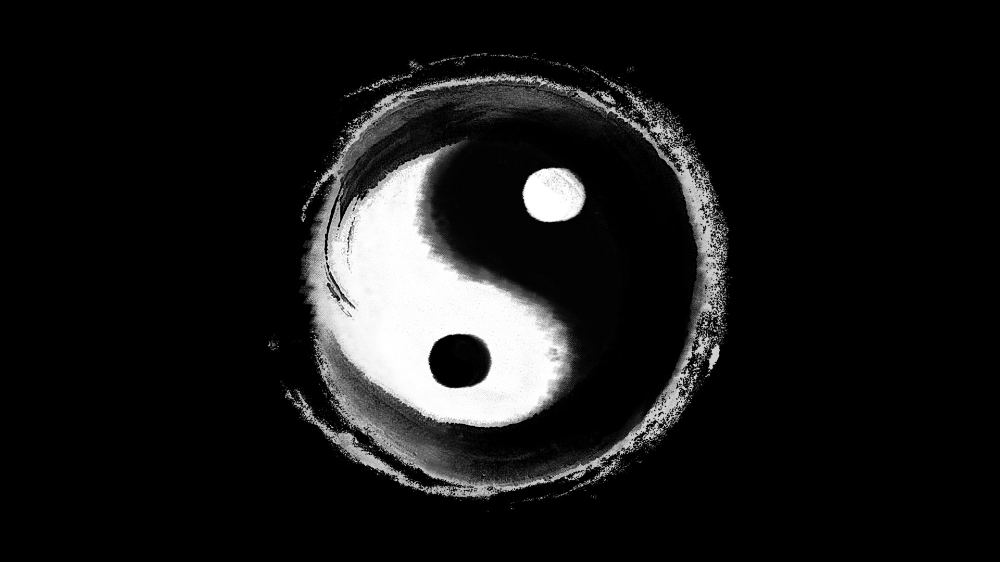

# 曾仕强解读易经笔记
* 伏羲氏一画开天地，这一画就是太极，易经被称为群经之源，

## 阴阳之道
```text
嗜欲深者天机浅，嗜欲浅者天机深
人要经常反省
太极生两仪，两仪生四象
乱中有序
自天佑之，吉无不利
孔子：一阴一阳之谓道（自然孕育），易有太极，是生两仪（阴阳）
一切都是有例外的，
一分为二（西方的观点）
一生二，二生三，三生万物（道家的观点）
```


## 参考链接
* 1 [曾仕强教授解读易经视频讲座](https://www.bilibili.com/video/BV1PK4y1L7fc?p=1)
* 1 [曾仕强教授解密道德经视频讲座](https://www.bilibili.com/video/BV1Ra4y1L7tT?p=1)


